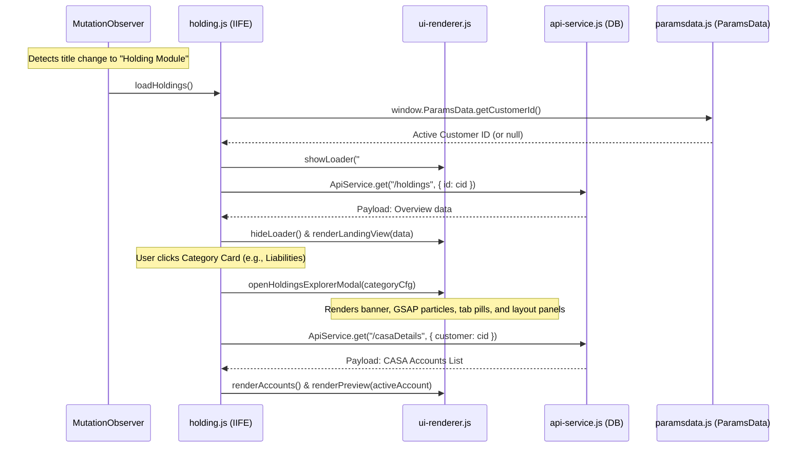

# Holdings Module Developer Guide - Technical Code Flow

This document details the step-by-step technical code flow of the **Portfolio Holdings Module** (`holding.js`) in the Customer 360 dashboard. It explains how the module hooks into dashboard navigation, retrieves the active customer ID, executes API calls, translates dynamic database fields, and manages layout views.

---

## Code Flow Diagram



---

## Detailed Step-by-Step Execution Flow

### 1. Navigation Hook & MutationObserver Trigger
The holdings module is decoupled and hooks itself into the main dashboard's quick access workspace (#quick-module-view) automatically.
* **Initialization**: In [holding.js](file:///c:/Users/Lenovo/Desktop/works/customer%20360/customer360/modules/holding/holding.js), an IIFE registers a jQuery-ready callback.
* **Observation**: It initializes a `MutationObserver` on the `#qm-title` header element.
* **Detection**: When the user clicks the **Holding** quick access card in the bottom grid, the dashboard title updates to `"Holding Module"`.
* **Execution**: The observer detects the change:
  - If the text is `"Holding Module"`, it calls `loadHoldings()`.
  - If the text is anything else, it calls `restoreDefaultHeader(title)` to revert holdings-active header classes and cleanup custom elements.

### 2. Active Customer ID Verification
* Inside `loadHoldings()`, the module assigns `currentCustomerId` by querying the global parameter access layer:
  ```javascript
  currentCustomerId = (window.ParamsData && window.ParamsData.getCustomerId) ? window.ParamsData.getCustomerId() : null;
  ```
* **Early Return**: If `currentCustomerId` is null (no active profile is loaded), the method triggers `window.UIRenderer.showEmptyState("#qm-content")` and halts further execution.

### 3. Fetching Portfolio Category Overview (API Call)
* **Loader Display**: Shows a loading animation capsule inside the quick access panel container: `window.UIRenderer.showLoader("#qm-content")`.
* **Endpoint Selection**: Resolves the API endpoint URL (defaults to `/holdings`).
* **Request Dispatch**: Calls `window.ApiService.get` passing the active ID parameter:
  ```javascript
  window.ApiService.get(endpoint, { id: currentCustomerId }, onSuccess, onError);
  ```
* **Filtering Payload**: The JSON database records are returned. The success callback dynamically filters the response to match the customer ID:
  ```javascript
  const custKey = fName("customerId"); // Resolves dynamically to "customer"
  record = response.find(h => h[custKey] === currentCustomerId || h.id === currentCustomerId);
  ```

### 4. Rendering the Category Landing Grid
* If a valid record is returned, `renderLandingView(record)` generates category cards configured in `window.HOLDING_CONFIG` (representing *Assets*, *Liabilities*, or *Value Added Services*).
* **Summary Counts**: Retrieves the `subcategoriesCount` and `accountsCount` from the API payload corresponding to the category key and populates metrics.
* **Click Binding**: Registers click listeners on each category card to launch the modal tree:
  ```javascript
  openHoldingsExplorerModal(categoryCfg);
  ```

### 5. Launching the Holdings Explorer Modal
When a category card is clicked, the application expands into the full cinematic detail view (`#detail-view`):
* **Banner Header & Parallax**: Injects category titles and description, updates the hero image (`#detail-img`) on a radial glowing backdrop, and triggers GSAP particles (`#hero-particles`).
* **Layout Division**: Empties `#detail-content-area` and restructures it into a two-panel flex layout:
  - **Left Panel**: Subcategory tabs navigation bar, search input, and account list container.
  - **Right Panel**: A details preview pane (`#explorer-detail-preview`).
* **Page Lock**: Locks parent page scrolling by setting `document.body.style.overflow = 'hidden'`.
* **Tab Navigation**: Renders subcategory tab pills (e.g. *Loans* for Assets, or *CASA*, *Deposits*, *Gold Accounts* for Liabilities) with active styles.

### 6. Fetching Subcategory Accounts (Dynamic Tab Loading)
* Clicking a subcategory tab calls `loadActiveCategoryItems()`.
* **Sub-API Request**: Resolves the specific tab endpoint (e.g., `/casaDetails` or `/loans`).
* **Query Parameter Mapping**: Dispatches a GET request to that endpoint with the translated parameter key for the customer ID:
  ```javascript
  const custKey = fName("customerId"); // Resolves to "customer"
  const params = {};
  params[custKey] = currentCustomerId;
  window.ApiService.get(tabEndpoint, params, onSuccess, onError);
  ```
* **Local Filtering**: Filters the resulting list locally to ensure only data matching `currentCustomerId` is retained.

### 7. Account Search & Filtering
* **Input Listener**: Binds an `.on("input")` listener to `#explorer-search-input`.
* **Query Filter**: `filterActiveCategoryItems(query)` filters the tab accounts list against translated name/number fields:
  ```javascript
  const nameKey = fName("title");       // Resolves to "name"
  const numberKey = fName("subtitle");  // Resolves to "number"
  const filtered = activeTabAccounts.filter(acc =>
    acc[nameKey].toLowerCase().includes(query) || acc[numberKey].toLowerCase().includes(query)
  );
  ```

### 8. Rendering the Accounts List & Selected Detail Preview
* **Accounts List**: `renderAccounts(accountList)` creates HTML items for each account displaying:
  - Account Name (`acc[fName("title")]`)
  - Account Number (`acc[fName("subtitle")]`)
  - Account Balance (`acc[fName("value")]`)
  - Account Status Badge (`acc[fName("tag")]`)
* **Selection State**: Tracks the currently active index and highlights the card capsule.
* **Detail Preview Panel**: Calls `renderPreview(activeAccount)` to render metadata on the right panel:
  - Resolves sections using `acc[fName("details")]` or `acc[fName("fullDetails")]`.
  - Maps dynamic icons depending on the field label name (e.g., `💰` for balance fields, `📅` for date fields, `📍` for addresses).
  - Renders fields inside a clean grid layout using `gap: 1px` dividers and dynamic column spans based on character lengths.
